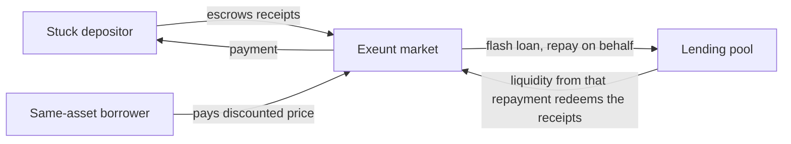

# Exeunt

An exit market for frozen lending pools.

When a lending pool reaches 100% utilization, depositors cannot withdraw: every unit of the asset is lent out. On 18 April 2026 Aave's WETH pool on Arbitrum sat at 100% for more than a day (148,194 WETH supplied, 0.0001 WETH withdrawable). Robinhood Earn's Steakhouse USDG vault holds $531M with about 8.6% withdrawable at any moment.

Exeunt lets stuck depositors sell their deposit receipts (aWETH on Aave, Earn vault shares on Morpho) at a discount, and get paid immediately, without taking a single unit of liquidity out of the pool.

**Live demo: [exeunt.space](https://exeunt.space)** · API: `https://api.exeunt.space` · MCP: `https://api.exeunt.space/mcp`

The two scenario forks are hosted too: pick *Kelp replay* or *Earn bank-run* in the network selector, connect the demo wallet and use "Get demo funds".

## How it works

The natural buyer of a stuck receipt is someone who owes the same asset. Exeunt makes the trade atomic:

1. The market flash-borrows the underlying (from the pool itself, or from Morpho, which is free).
2. It repays the buyer's debt on their behalf. The pool now has that much new liquidity.
3. It uses exactly that liquidity to redeem the seller's escrowed receipts, and returns the flash loan.
4. The buyer pays the seller the discounted price: from their wallet, or in **flash mode** with the collateral that the repayment just freed (no cash needed).

The pool's withdrawable liquidity is the same before and after. The seller gets paid now; the borrower repays debt below face value. Buyers use ordinary wallets; no smart account or EIP-7702 is required.



Sellers can also sell straight into **limit bids**: escrowed orders from anyone (individuals, treasuries, liquidity bots) or from the **Exeunt Vault**, a pooled buyer that keeps its capital outside the pool it protects and bids by fixed rules (minimum discount, maximum share of capital per receipt). When the pool is liquid again, anyone can trigger the vault to redeem what it bought; the discount becomes depositors' profit.

Sellers who prefer to wait open a **Dutch auction** whose discount only rises; when it reaches a limit bid's level, anyone can match the two. Unsold receipts can be taken back at any time.

Exeunt also publishes each pool's **exit capacity** on-chain (withdrawable now, same-asset debt that can absorb receipts, escrowed bids per discount level), offers Aave borrowers whose collateral is frozen a **fallback route** (sell the aToken collateral into bids to repay debt or swap collateral), and exposes everything to apps and AI agents through an SDK and an MCP server.

## Repository

| Path | What it is |
|---|---|
| `contracts/` | Solidity (Foundry): `ExitMarket` core, Aave and Morpho venues, `ExeuntVault`, `AaveCollateralRoute`, price feeds, deployment script |
| `packages/sdk` | TypeScript SDK (viem): reads, quotes, sell planning, unsigned transaction builders, Morpho EIP-712 signing |
| `packages/mcp` | MCP server for AI agents: reads, simulates and builds unsigned transactions; never holds keys |
| `packages/forkkit` | Anvil helpers: token balances, impersonation, time travel, demo position kits |
| `apps/web` | Web app (React + Vite) |
| `apps/backend` | Express API: capacity history, utilization alerts with signed webhooks, fork faucet, hosted MCP |
| `tools/e2e` | Unattended end-to-end runner for forks and live testnets; `fork:up` for demo forks |
| `docs/` | [Security model](docs/security.md), [test report](docs/test-report.md) |

## Networks

| Network | Venue | Receipt | Status |
|---|---|---|---|
| Arbitrum Sepolia | Aave V3 (testnet market) | aWETH | Live |
| Robinhood Testnet | Morpho Blue + Vault V2, deployed by us (no Morpho on that testnet) | Earn USDG vault shares | Live |
| Kelp replay | Arbitrum One fork at block 453,918,025 (18 Apr 2026, WETH at 100%) | aWETH | Hosted fork |
| Earn bank-run | Robinhood Chain fork at block 79,876,918 against the Steakhouse USDG vault | Earn USDG vault shares | Hosted fork |

### Arbitrum Sepolia

| Contract | Address |
|---|---|
| AaveExitMarket (aWETH) | [`0xD62db8A8eED08d2f81D9b838a37f3b54CF6df947`](https://sepolia.arbiscan.io/address/0xD62db8A8eED08d2f81D9b838a37f3b54CF6df947) |
| ExeuntVault (WETH) | [`0x4E78CF9E2672d9f218d9Fd7cd9AeB06f5F027028`](https://sepolia.arbiscan.io/address/0x4E78CF9E2672d9f218d9Fd7cd9AeB06f5F027028) |
| AaveCollateralRoute | [`0x425fd6d6b23Da6ed8D915Bd7EFF405E64751bf3E`](https://sepolia.arbiscan.io/address/0x425fd6d6b23Da6ed8D915Bd7EFF405E64751bf3E) |
| PriceRouter | [`0xECFdc42919334Ad7423C78dcF0CD9EDace258BE0`](https://sepolia.arbiscan.io/address/0xECFdc42919334Ad7423C78dcF0CD9EDace258BE0) |

Sources are verified on Arbiscan and [Sourcify](https://sourcify.dev/#/lookup/0xD62db8A8eED08d2f81D9b838a37f3b54CF6df947). Payment assets: USDG (Paxos), USDC, WETH. The testnet WETH pool is already about 99.8% utilized, so it is a real frozen pool.

### Robinhood Testnet

Robinhood Testnet has no Morpho deployment, so the deployment script brings up Morpho Blue, the AdaptiveCurveIrm and a Vault V2 shaped like Robinhood Earn on Paxos testnet USDG, with a simulated USDe as borrower collateral.

| Contract | Address |
|---|---|
| MorphoVaultExitMarket (Earn USDG shares) | [`0x8307e39e03619f9454c146EDdbD2C544A4499116`](https://explorer.testnet.chain.robinhood.com/address/0x8307e39e03619f9454c146EDdbD2C544A4499116) |
| ExeuntVault (USDG) | [`0xaD5F6c0b898699bBcf3De4F64FfFa58Dc29D81d8`](https://explorer.testnet.chain.robinhood.com/address/0xaD5F6c0b898699bBcf3De4F64FfFa58Dc29D81d8) |
| Earn USDG vault (Vault V2) | [`0x06FCA6bc7D8086afa2DCf8B1baDfe5AC7a1D301C`](https://explorer.testnet.chain.robinhood.com/address/0x06FCA6bc7D8086afa2DCf8B1baDfe5AC7a1D301C) |
| Morpho Blue | [`0x3F36b776DF279B9284Eee44f534D020573c90200`](https://explorer.testnet.chain.robinhood.com/address/0x3F36b776DF279B9284Eee44f534D020573c90200) |

All sources are verified on the Robinhood Testnet explorer. Payment assets: USDG and the simulated USDe collateral (for flash mode).

## Running it

Requirements: Node 20+, [Foundry](https://getfoundry.sh).

```bash
git clone --recursive <repo> && cd exeunt
npm install
npm run abis                         # export contract ABIs into the SDK (after contract changes)
npm run build -w @exeunt/sdk -w @exeunt/forkkit -w @exeunt/mcp
```

Contracts:

```bash
cd contracts
forge build
forge test                           # fork tests need ARB_SEPOLIA_RPC in ../.env, otherwise they skip
```

Demo forks, backend and web app:

```bash
npm run fork:up -w @exeunt/e2e -- --network=kelp-replay,earn-bank-run   # anvil on 8602 / 8604, seeded
npm run dev -w @exeunt/backend                                           # http://127.0.0.1:8787
npm run dev -w @exeunt/web                                               # http://localhost:5173
```

On the forks, use the web app's demo wallet and "Get demo funds" (seller, borrower or bidder kit). Browser wallets are disabled on forks because they reuse real chain ids.

MCP server for an agent (stdio):

```json
{ "mcpServers": { "exeunt": { "command": "node", "args": ["packages/mcp/dist/index.js"] } } }
```

The hosted backend serves the same server over Streamable HTTP at `https://api.exeunt.space/mcp`.

Deploying:

```bash
cd contracts
DEPLOY_NETWORK=arbitrum-sepolia forge script script/Deploy.s.sol --rpc-url $ARB_SEPOLIA_RPC --broadcast
node script/fix-deploy-block.mjs arbitrum-sepolia 421614
```

On Robinhood Chain (an Arbitrum Orbit chain), pass `--gas-estimate-multiplier 300`: forge's local gas estimate does not include the L1 data fee, and small transactions otherwise run out of gas.

Hosting (GCP VM behind a Cloudflare Tunnel; the server holds no private keys):

```bash
CF_API_TOKEN=... node infra/cloudflare-tunnel.mjs   # tunnel, hostnames and DNS for exeunt.space
bash infra/deploy.sh                                 # build, ship and provision the VM
```

The VM runs both scenario forks under systemd on localhost; the public reaches them only through the backend's JSON-RPC proxy (`/rpc/<network>`), which forwards standard methods and signed transactions and blocks anvil's cheat methods. Forks reset to their seeded state once a day.

## Testing

```bash
cd contracts && forge test                                  # unit, fuzz, invariant, fork
npm test                                                    # SDK, MCP, backend, web
npm run e2e -w @exeunt/e2e -- --network=all                 # full flows on four forks, report in reports/
npm run e2e -w @exeunt/e2e -- --network=arbitrum-sepolia,robinhood-testnet --live   # real testnet funds
npm run ui -w @exeunt/e2e -- --url=https://exeunt.space      # drives the deployed web app in headless Chrome
```

The end-to-end runner starts its own forks, deploys with the Foundry script, creates positions, and runs every flow through the SDK with signed transactions, checking balances, debt, health and the pool's withdrawable liquidity at every step. Results are in [docs/test-report.md](docs/test-report.md).

## Design notes

- No owner, no admin, no upgrades, no fees. Every parameter is fixed at deployment.
- Same-asset payments never touch an oracle. Cross-asset quotes use Chainlink feeds with a staleness bound; USDG and USDe use fixed $1 feeds where no feed exists.
- On Morpho, flash mode needs the buyer's signed authorization; the market applies a signed revoke in the same transaction and reverts if any authorization remains.
- See [docs/security.md](docs/security.md) for the full trust model and known limitations.

Built for the Arbitrum Open House Singapore buildathon with Arbitrum, Robinhood Chain, Paxos USDG, Aave V3, Morpho and OpenZeppelin Contracts.

## License

MIT
