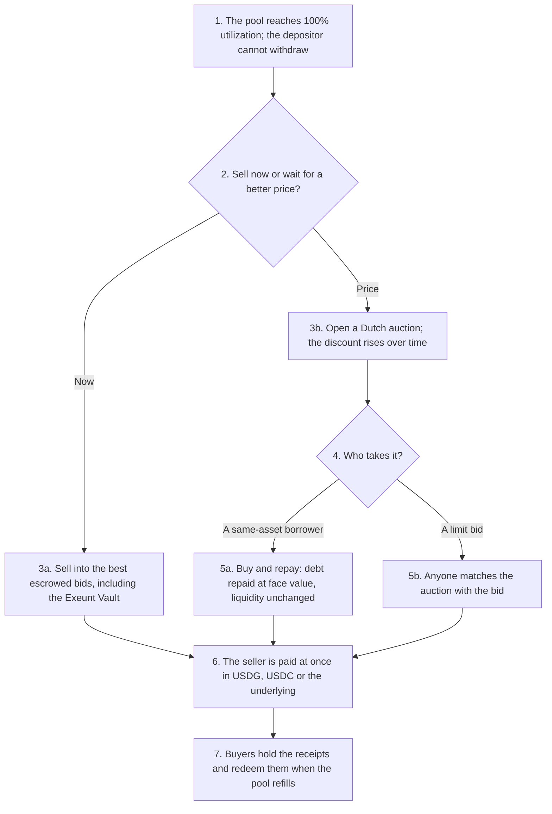
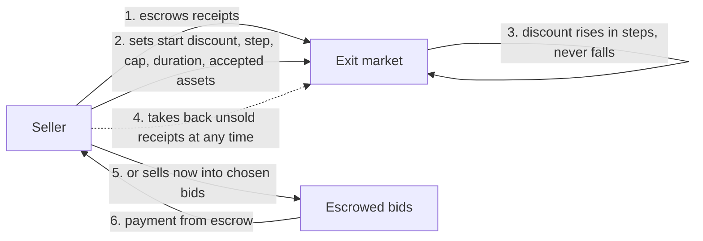
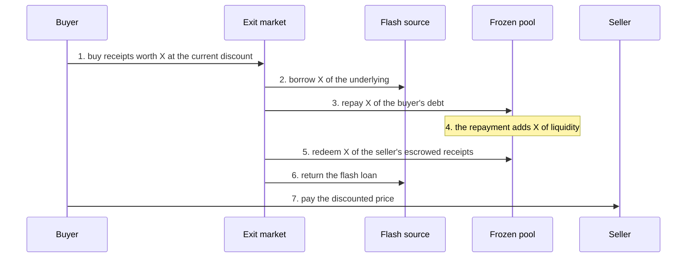
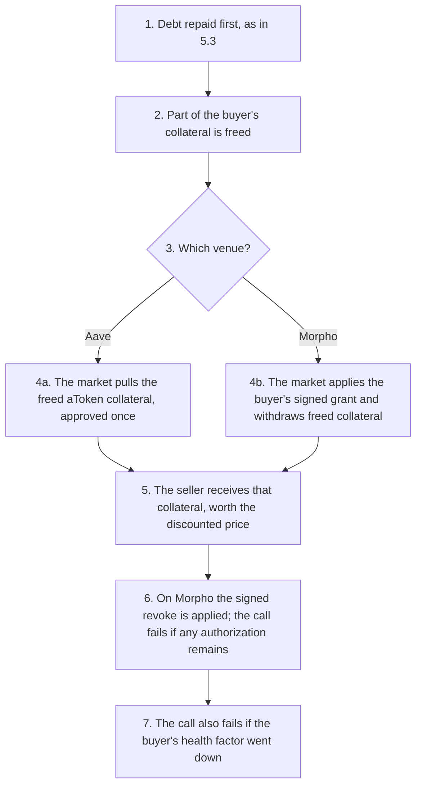
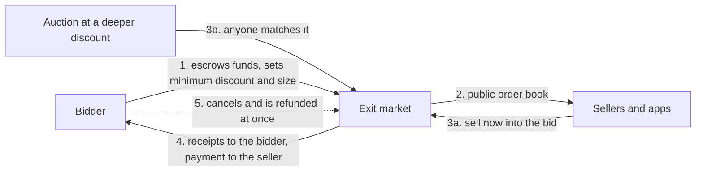
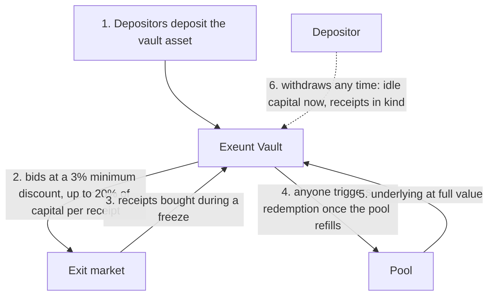
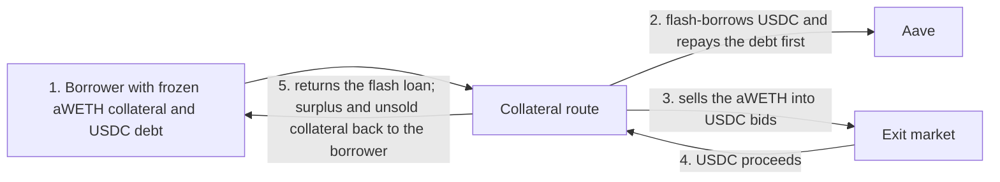

# Exeunt: the exit market for frozen lending pools

## 1. Introduction

Exeunt is an exit market for frozen lending pools on Arbitrum and Robinhood Chain. When a pool hits 100% utilization and depositors cannot withdraw, Exeunt lets them sell their deposit receipt (aWETH on Aave V3, Earn vault shares on Morpho) at a discount and get paid immediately, without taking a single unit of liquidity out of the pool.

The natural buyer of a stuck receipt is someone who owes the same asset. Exeunt repays that borrower's debt on their behalf with a flash loan, uses the liquidity the repayment creates to redeem the seller's receipt, and settles the trade in one transaction. Sellers can also sell straight into escrowed limit bids or to the Exeunt Vault, a pooled buyer of last resort that bids by fixed rules from the first minute of a freeze.

## 2. Demo material

Links:

| | |
|---|---|
| Demo video | _to be added_ |
| Pitch video | _to be added_ |
| Website | <https://exeunt.space> |
| API | <https://api.exeunt.space> |
| MCP server (Streamable HTTP) | <https://api.exeunt.space/mcp> |
| GitHub | _to be added_ |
| Test report | [`docs/test-report.md`](test-report.md) |

The website has four networks: two live testnets, and two hosted forks that replay real freezes. On the forks, a demo wallet and a "Get demo funds" button give anyone a seller, borrower or bidder position in one click.

| Network | What it shows |
|---|---|
| Arbitrum Sepolia | Live Aave V3 testnet market; its WETH pool is already about 99.8% utilized |
| Robinhood Testnet | Live Morpho Blue + Vault V2 stack shaped like Robinhood Earn, on Paxos testnet USDG |
| Kelp replay | Arbitrum One forked at block 453,918,025 (18 Apr 2026), when Aave's WETH pool sat at 100% |
| Earn bank-run | Robinhood Chain forked at block 79,876,918 against the live Steakhouse USDG vault, after a bank run drains it |

Contracts on Arbitrum Sepolia:

| Contract | Address | Source |
|---|---|---|
| Exit market (aWETH) | [`0xD62db8A8eED08d2f81D9b838a37f3b54CF6df947`](https://sepolia.arbiscan.io/address/0xD62db8A8eED08d2f81D9b838a37f3b54CF6df947) | [`venues/aave`](../contracts/src/venues/aave/AaveExitMarket.sol) |
| Exeunt Vault (WETH) | [`0x4E78CF9E2672d9f218d9Fd7cd9AeB06f5F027028`](https://sepolia.arbiscan.io/address/0x4E78CF9E2672d9f218d9Fd7cd9AeB06f5F027028) | [`vault`](../contracts/src/vault/ExeuntVault.sol) |
| Frozen-collateral route | [`0x425fd6d6b23Da6ed8D915Bd7EFF405E64751bf3E`](https://sepolia.arbiscan.io/address/0x425fd6d6b23Da6ed8D915Bd7EFF405E64751bf3E) | [`route`](../contracts/src/route/AaveCollateralRoute.sol) |
| Price router | [`0xECFdc42919334Ad7423C78dcF0CD9EDace258BE0`](https://sepolia.arbiscan.io/address/0xECFdc42919334Ad7423C78dcF0CD9EDace258BE0) | [`shared/oracle`](../contracts/src/shared/oracle/PriceRouter.sol) |

Contracts on Robinhood Testnet:

| Contract | Address | Source |
|---|---|---|
| Exit market (Earn USDG shares) | [`0x8307e39e03619f9454c146EDdbD2C544A4499116`](https://explorer.testnet.chain.robinhood.com/address/0x8307e39e03619f9454c146EDdbD2C544A4499116) | [`venues/morpho`](../contracts/src/venues/morpho/MorphoVaultExitMarket.sol) |
| Exeunt Vault (USDG) | [`0xaD5F6c0b898699bBcf3De4F64FfFa58Dc29D81d8`](https://explorer.testnet.chain.robinhood.com/address/0xaD5F6c0b898699bBcf3De4F64FfFa58Dc29D81d8) | [`vault`](../contracts/src/vault/ExeuntVault.sol) |
| Earn USDG vault (Vault V2) | [`0x06FCA6bc7D8086afa2DCf8B1baDfe5AC7a1D301C`](https://explorer.testnet.chain.robinhood.com/address/0x06FCA6bc7D8086afa2DCf8B1baDfe5AC7a1D301C) | Morpho Vault V2 |
| Morpho Blue | [`0x3F36b776DF279B9284Eee44f534D020573c90200`](https://explorer.testnet.chain.robinhood.com/address/0x3F36b776DF279B9284Eee44f534D020573c90200) | Morpho Blue |
| Price router | [`0x1e474158f103102Ef4ad2Aa8AACdd93e3889b280`](https://explorer.testnet.chain.robinhood.com/address/0x1e474158f103102Ef4ad2Aa8AACdd93e3889b280) | [`shared/oracle`](../contracts/src/shared/oracle/PriceRouter.sol) |

Both exit markets build on the shared core in [`contracts/src/market/ExitMarket.sol`](../contracts/src/market/ExitMarket.sol): Dutch-auction sessions, escrowed limit bids, matching and pricing.

> **Every contract is verified.** Arbitrum Sepolia sources are verified on Arbiscan and Sourcify; all eleven Robinhood Testnet contracts (Exeunt and the Morpho stack it runs on) are verified on the Robinhood Testnet explorer. There is no owner, no admin function and no upgrade path: every parameter is fixed at deployment.

## 3. Problem and solution

### The problem

Lending pools pay depositors from what borrowers have not taken. When borrowers take everything, the pool freezes:

- **Depositors cannot leave.** On 18 April 2026, Aave's WETH pool on Arbitrum held 148,194 WETH of deposits and 0.0001 WETH that could be withdrawn, and stayed at 100% for more than a day. Every depositor and every looper was stuck until borrowers repaid.
- **Freezes are routine, not rare.** Robinhood Earn's Steakhouse USDG vault holds about $531M; on 4 October 2026 about $45.7M of it (8.6%) could leave at once. A bank run on the rest would freeze it.
- **Waiting is the only built-in exit.** A deposit receipt (aWETH, vault shares) is a claim on a frozen pool. There is rarely a market for it, and selling it OTC means finding and trusting a counterparty in the middle of a crisis.
- **Borrowers are stuck too.** An Aave borrower whose collateral sits in a frozen pool cannot withdraw it to repay or rebalance.

### The solution

Exeunt turns the stuck receipt into something people want to buy:

- **Borrowers are the natural buyers.** Someone who owes WETH can buy aWETH at a discount and have their debt repaid at face value. Exeunt does it in one transaction: a flash loan repays the debt on the buyer's behalf, the liquidity that creates redeems the seller's receipt, and the flash loan is paid back. The pool's withdrawable liquidity is unchanged.
- **Buyers who do not borrow can still buy.** Anyone can post escrowed limit bids, ahead of time. The Exeunt Vault pools capital and bids by fixed rules, so a buyer is waiting from the first minute of a freeze.
- **Sellers choose speed or price.** Sell now into the best escrowed bids, or open a Dutch auction whose discount only rises until a borrower or a bid takes it. Unsold receipts come back at once, at any time.
- **Risk is visible before a freeze.** Every pool's exit capacity (withdrawable now, same-asset debt that can absorb receipts, escrowed bids per discount) is published on-chain, with alerts when utilization crosses a threshold.

## 4. USP

Exeunt provides unique selling points compared to existing ways out of a frozen pool:

1. **An exit that does not drain the pool.** Every other exit competes for the same scarce liquidity. Exeunt creates the liquidity it uses: the buyer's debt repayment funds the seller's withdrawal in the same transaction, so the pool is no less liquid afterwards. The end-to-end tests assert this for every purchase on the replayed freezes, and the live testnet runs record the same withdrawable liquidity before and after each purchase.
2. **Borrowers repay for less.** For a borrower, buying a receipt at a 5% discount means repaying 100 of debt for 95. That turns every same-asset borrower into a buyer with a reason to act during the freeze, which is exactly when sellers need one.
3. **No cash needed, even for the buyer.** In flash mode the buyer pays the seller with the collateral that the debt repayment frees up. The buyer's health factor only improves, and on Morpho the collateral authorization is signed off-chain and revoked inside the same transaction.
4. **Works with ordinary wallets.** Repaying someone else's debt, redeeming receipts and returning the flash loan happen inside the market contract, so buyers and sellers sign one normal transaction. No smart account, no EIP-7702, no bundler.
5. **Buyers in place before the crisis.** Limit bids are escrowed, so a seller knows they will pay. The Exeunt Vault keeps its capital outside the pool it protects and bids at a fixed minimum discount, up to a fixed share of its capital per receipt. Depositors can always withdraw: idle capital at once, bought receipts in kind.
6. **Exit capacity as a public good.** Curators, risk teams and other protocols can read each pool's exit capacity on-chain with one call, with no permission and no fee, and get webhook alerts before utilization becomes a freeze.

**Compared with existing approaches:**

| | Wait for liquidity | Sell on a DEX | OTC deal | **Exeunt** |
|---|---|---|---|---|
| Get paid while the pool is frozen | No | Only if a pool for the receipt exists and is deep enough | After finding a counterparty | **Yes** |
| Takes liquidity from the frozen pool | – | No | No | **No** |
| Buyers ready before the freeze | – | Liquidity providers, if any | No | **Escrowed bids and the Exeunt Vault** |
| Counterparty risk | None | None | Yes | **None: atomic or escrowed** |
| Uses borrowers' demand to repay | No | No | No | **Yes, debt repaid at a discount** |
| Exit capacity visible in advance | Utilization only | No | No | **Yes, on-chain** |

What stays true by design: a buyer holds the receipt until the pool is liquid again, so buyers take on the pool's risk, including any bad debt. Payments in a different asset than the receipt are priced with Chainlink feeds; USDG and USDe use a fixed $1 where no feed exists. The contracts are not audited.

## 5. How it works

### 5.1. Overall

Exeunt combines four parts:

- **An exit market per receipt** (aWETH on Aave, Earn shares on Morpho) with Dutch-auction sessions, escrowed limit bids and atomic buy-and-repay.
- **The Exeunt Vault**, a pooled buyer that bids by fixed rules and recovers what it bought when the pool refills.
- **Public exit capacity**, read on-chain and tracked by a backend that sends alerts.
- **Integrations** for apps and AI agents: an SDK, an MCP server and webhooks.

The flow below follows a stuck deposit from the freeze to the exit.

1. Borrowers have taken all of the pool's liquidity; deposits cannot be withdrawn.
2. The depositor chooses between selling now and waiting for a better price.
3. **3a.** Selling now fills the escrowed bids with the smallest discount first. **3b.** An auction starts at a small discount that only rises.
4. Whoever accepts the current discount buys.
5. **5a.** A borrower of the same asset buys and has their debt repaid in the same transaction. **5b.** When the auction reaches a bid's discount, anyone can match the two.
6. The seller is paid immediately in the asset they accepted.
7. Buyers keep the receipt, which keeps earning interest, and redeem it at full value when liquidity returns.

### 5.2. Selling: auctions and sell-now

How a stuck depositor gets out, and what they control.

1. The seller escrows receipts in the market.
2. They choose the curve (for example 1% at the start, +0.5% an hour, capped at 15%) and the assets they accept.
3. The discount only rises with time, so waiting longer means a better deal for buyers and a fill sooner.
4. Unsold receipts come back at once, with no waiting period; what already sold stays sold.
5. Or the seller sells straight into escrowed bids, smallest discount first.
6. Each bid pays from its escrow, at its own limit price.

### 5.3. Buy and repay

How a borrower buys a stuck receipt without taking any liquidity out of the pool.

1. The buyer picks an auction and an amount; they must owe at least that much of the same asset.
2. The market borrows the underlying for the length of the transaction: from Morpho (free) or from the Aave pool itself.
3. It repays the buyer's debt on their behalf.
4. That repayment is new liquidity in the pool.
5. The market uses exactly that liquidity to redeem the seller's escrowed receipts.
6. It returns the flash loan. If even the pool's last unit of liquidity is gone, a small flash loan is reused in rounds, up to 64 per purchase.
7. The buyer pays the seller the discounted price, so their debt fell by 100 for, say, 95. The pool's withdrawable liquidity is the same as before.

### 5.4. Flash mode: paying with freed collateral

For a buyer who has debt but no cash.

1. The market repays the buyer's debt first, exactly as in 5.3.
2. With less debt, part of the collateral is no longer needed.
3. Each venue releases it differently.
4. **4a.** On Aave, the buyer approves the market once for their collateral aToken; the market redeems it to pay the seller. **4b.** On Morpho, the buyer signs two EIP-712 messages, a grant and a revoke; no transaction is needed for them.
5. The seller receives the collateral asset (for example USDC or USDe), worth the discounted price.
6. On Morpho, the revoke is applied in the same transaction and the market checks that no authorization survives.
7. The collateral taken is always worth less than the debt repaid, so the health factor goes up; the contract checks it.

### 5.5. Limit bids

Buyers who do not borrow, ready before any freeze.

1. A bidder escrows USDG, USDC or the underlying and sets the minimum discount they accept.
2. Bids form a public order book; only escrowed funds count.
3. **3a.** A seller sells straight into the bid. **3b.** When an auction's discount reaches the bid, anyone can match them.
4. The bidder receives receipts; the seller receives the escrow.
5. A bid can be cancelled at any time; unused escrow comes back in the same transaction.

### 5.6. Exeunt Vault

A shared buyer of last resort that earns the discount.

1. Depositors put in the vault asset (WETH on Arbitrum, USDG on Robinhood Chain).
2. The vault keeps its capital out of the pool it protects and holds it as escrowed bids, by rules fixed at deployment.
3. During a freeze, sellers sell to it at once.
4. When the pool refills, anyone can trigger the vault to redeem what it bought.
5. The discount becomes depositors' profit.
6. Depositors can always leave: idle capital is paid out immediately, receipts already bought are paid in kind.

### 5.7. Exit capacity and alerts

How depositors, curators and risk teams see a freeze coming.

1. Each market exposes its pool's exit capacity on-chain in one view call: withdrawable now, total supplied, utilization, same-asset debt that can absorb receipts, and receipts already for sale.
2. A second call returns how much escrowed bids would buy at a given discount.
3. The backend snapshots capacity every minute and keeps seven days of history for the utilization chart.
4. Users set a utilization threshold; when it is crossed, they get an in-app alert and a signed webhook (HMAC-SHA256), retried if delivery fails.

### 5.8. Frozen collateral

For Aave borrowers whose collateral is the frozen asset.

1. The borrower cannot withdraw collateral from the frozen pool to repay or rebalance.
2. The route repays the debt first, so the health factor never dips mid-way.
3. It sells the frozen aToken collateral into escrowed bids instead of withdrawing it.
4. The bids pay in the debt asset.
5. The flash loan is returned; anything left over goes back to the borrower. A second mode swaps frozen collateral for new collateral instead.

On Morpho this is not needed: collateral there is never lent out.

### 5.9. Integrations for apps and AI agents

- **On-chain reads:** exit capacity, auctions and the order book, with no permission and no fee.
- **SDK:** TypeScript (viem); every action returns an unsigned transaction, plus sell planning and Morpho signing helpers.
- **MCP server:** 18 tools for AI agents to read markets, quote, plan a sale, simulate, and build unsigned transactions. It never holds keys; signing stays with the user's or the agent's wallet. Available over stdio and at `https://api.exeunt.space/mcp`.
- **Webhooks:** signed utilization alerts for curators and risk tooling.

### 5.10. Web app and demo networks

- **Pages:** Overview with exit capacity, Sell, Buy and repay, Earn (Exeunt Vault and limit bids), Frozen collateral, and Developers.
- **Wallets:** a browser wallet on live testnets, or a built-in demo wallet; every transaction is simulated before it is sent.
- **Hosted forks:** the two replayed freezes run on a server behind a Cloudflare Tunnel. The public reaches them through a JSON-RPC proxy that forwards standard calls and signed transactions and blocks the fork node's cheat methods, so visitors cannot rewrite the demo. A faucet hands out seller, borrower and bidder positions.

## 6. Contribution to Arbitrum

- **Safer lending markets.** Depositors in Arbitrum lending pools get an exit during a freeze, which makes depositing less risky and supplying liquidity more attractive.
- **No race for the last units.** An exit through Exeunt funds itself instead of using the pool's withdrawable liquidity, so depositors leaving through Exeunt do not compete with those who withdraw directly, and a freeze no longer has to become a bank run.
- **Robinhood Earn and USDG.** Exeunt brings the same exit to Morpho vaults on Robinhood Chain, an Arbitrum Orbit chain, and moves Paxos USDG as the main payment and escrow asset.
- **Public risk data.** Exit capacity is an on-chain primitive that curators, risk teams and other protocols on Arbitrum can read and build on.
- **Agent-ready DeFi.** With the SDK and MCP server, AI agents can watch exit capacity, sell early, or repay debt in flash mode during a freeze, without ever holding a user's keys.

## 7. Use cases

Exeunt fits best when a pool is near or at 100% utilization and someone holding a receipt needs to get out before liquidity returns.

| Use case | Who sells to whom | Why Exeunt |
|---|---|---|
| **Stuck depositors** | A depositor sells aWETH or Earn shares to a borrower, a bid or the Exeunt Vault | They get paid now instead of waiting days for borrowers to repay, and choose between selling at once or auctioning for a better price. |
| **Loopers** | A leveraged depositor sells receipts to unwind | A loop cannot unwind while its supply is frozen; selling the receipt releases it without touching the pool's liquidity. |
| **Same-asset borrowers** | A WETH or USDG borrower buys receipts | They repay debt below face value, with no cash in flash mode, and their health factor improves. |
| **Treasuries and market makers** | A desk posts escrowed limit bids | They buy claims at a discount and redeem them at full value when the pool refills; the profit is the discount plus the interest the receipt keeps earning. |
| **Passive capital** | Depositors in the Exeunt Vault | One deposit stands ready for any freeze, bids by fixed rules, and can be withdrawn at any time. |
| **Vault curators and risk teams** | Read exit capacity and receive alerts | They see how much of a pool can get out, and how deep the bids are, before a freeze happens. |
| **Aave borrowers with frozen collateral** | Sell frozen aToken collateral into bids | They can repay debt or swap collateral when the collateral itself cannot be withdrawn. |
| **AI agents** | Manage positions through the MCP server | An agent can sell early when capacity falls, or repay debt in flash mode during a freeze, with the user signing. |

## 8. Tech stack

- **Smart contracts:** Solidity 0.8.28, Foundry, OpenZeppelin Contracts 5.4
- **Lending venues:** Aave V3 (Arbitrum Sepolia, Arbitrum One fork), Morpho Blue and Vault V2 with the AdaptiveCurveIrm (Robinhood Testnet, Robinhood Chain fork)
- **Prices:** Chainlink feeds behind an immutable price router; fixed $1 feeds for USDG and USDe where no feed exists
- **SDK and tools:** TypeScript, viem
- **MCP server:** Model Context Protocol SDK, stdio and Streamable HTTP
- **Backend:** Node.js, Express, Zod, pino, SQLite (node:sqlite)
- **Web app:** React, Vite
- **Testing:** Foundry unit, fuzz, invariant and fork tests; end-to-end runs on anvil forks and live testnets; headless Chrome tests of the hosted web app
- **Hosting:** Google Cloud VM, Cloudflare Tunnel, Caddy, systemd
- **Networks and tokens:** Arbitrum Sepolia, Robinhood Chain Testnet, Arbitrum One and Robinhood Chain forks; WETH, USDC, Paxos USDG
