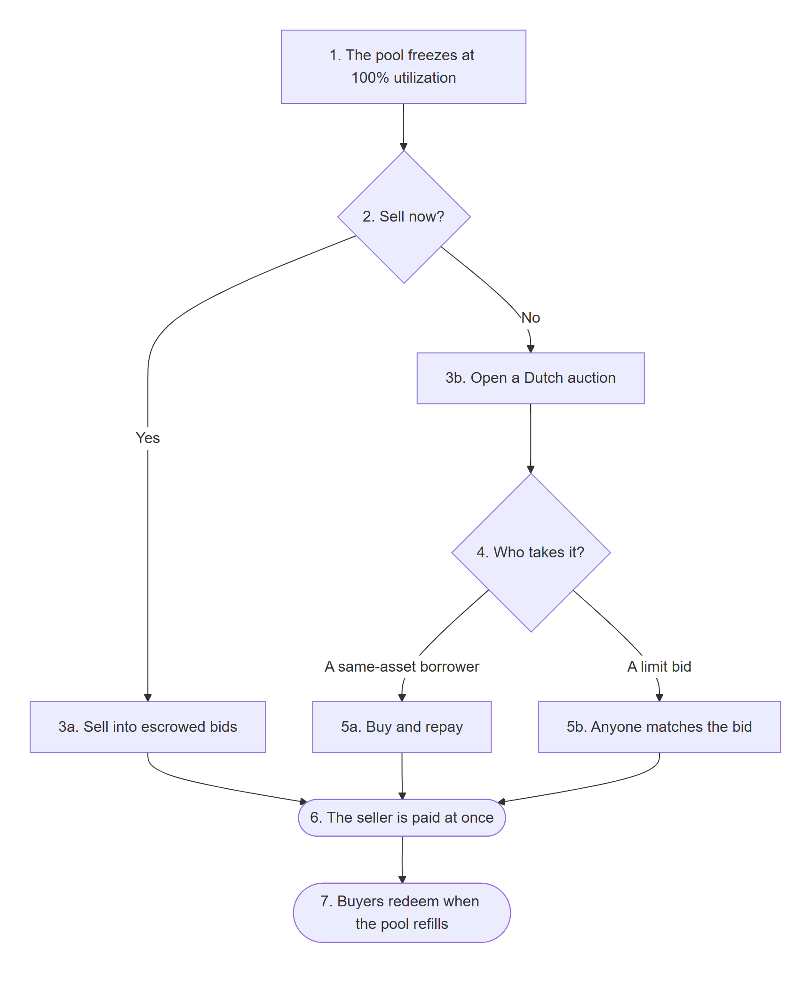
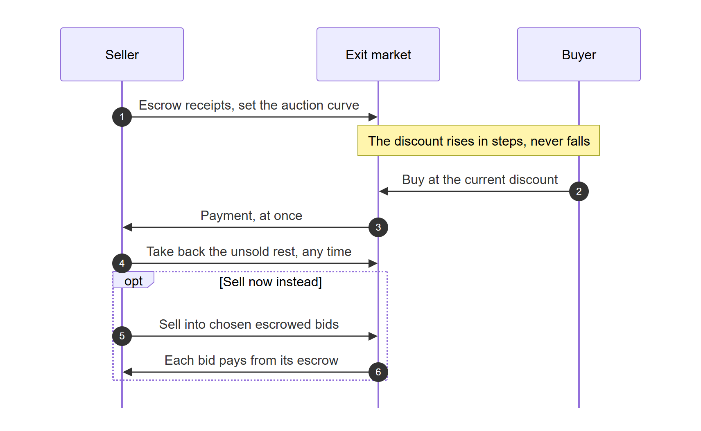
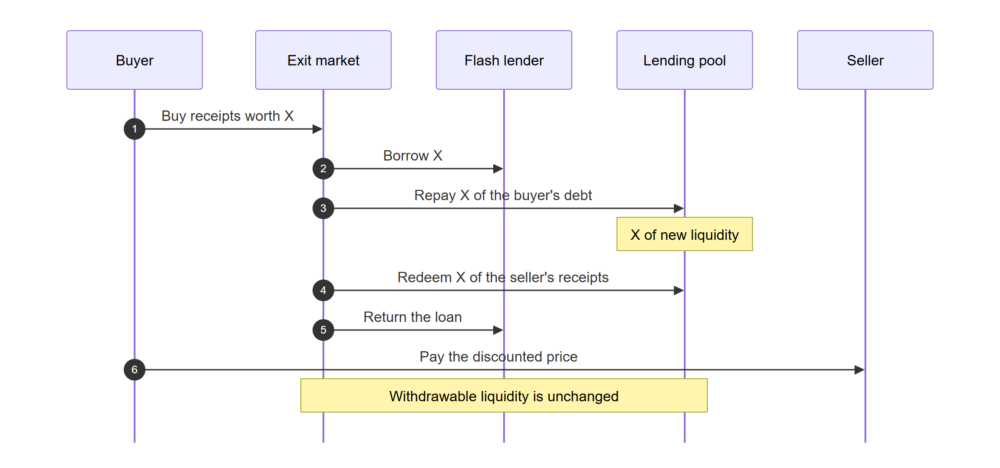
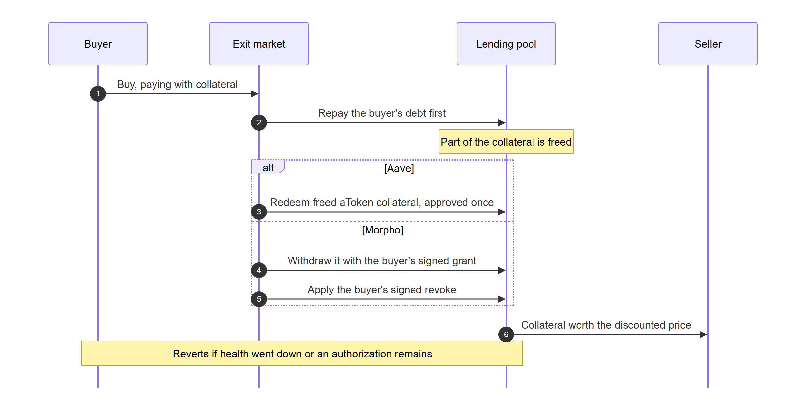
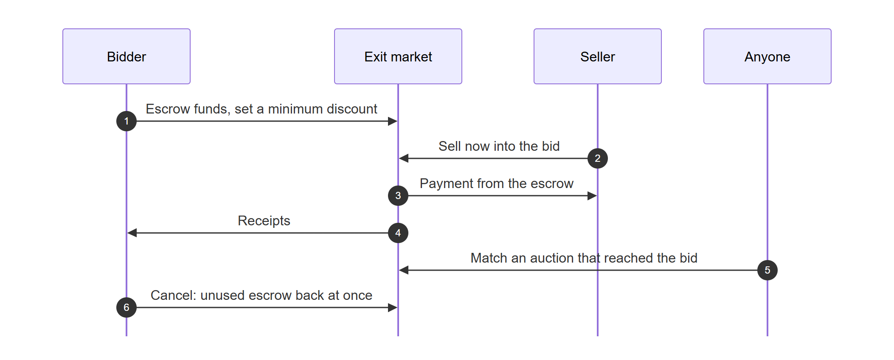
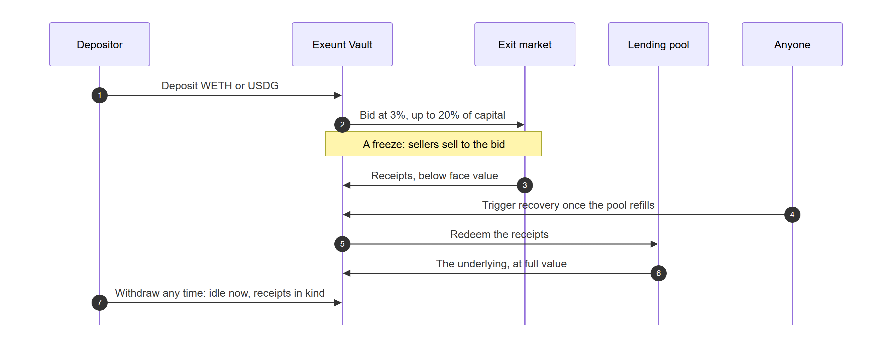
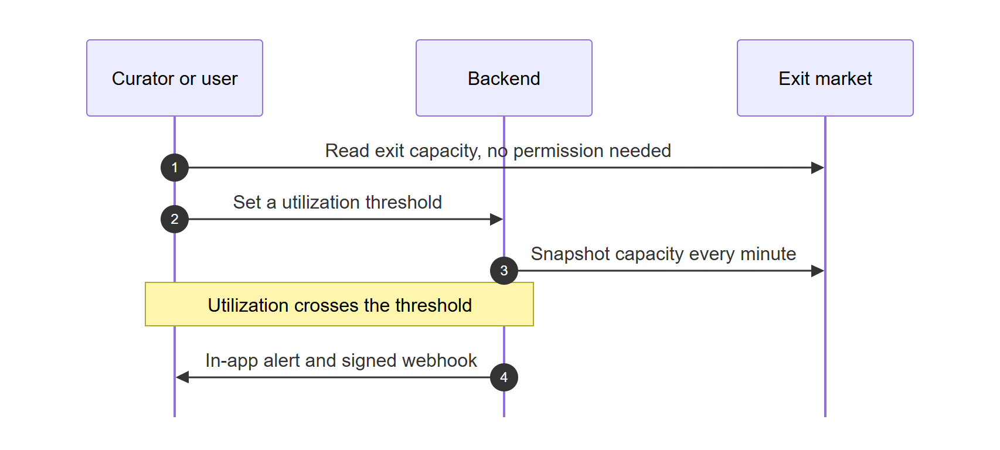
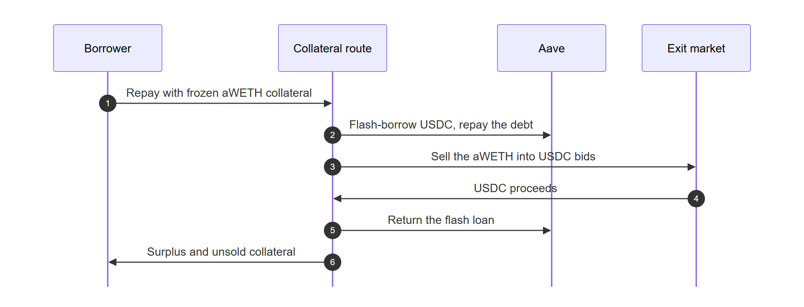

# Exeunt: the exit market for frozen lending pools

## 1. Introduction

Exeunt is an exit market for frozen lending pools on Arbitrum and Robinhood Chain. When a pool hits 100% utilization and depositors cannot withdraw, Exeunt lets them sell their deposit receipt (aWETH on Aave V3, Earn vault shares on Morpho) at a discount and get paid immediately, without taking a single unit of liquidity out of the pool.

A seller either opens a Dutch auction whose discount only rises, or sells now into escrowed bids. The natural buyer is a borrower of the same asset: Exeunt repays that borrower's debt with a flash loan, uses the liquidity the repayment creates to redeem the seller's receipt, and settles the trade in one transaction. In flash mode the borrower pays with the collateral the repayment frees, so they need no cash. Buyers who do not borrow post escrowed limit bids before any freeze, or deposit in the Exeunt Vault, a pooled buyer of last resort that bids by fixed rules and earns the discount.

Around the market, every pool's exit capacity is published on-chain, with alerts before a freeze, and Aave borrowers whose collateral is the frozen asset can repay their debt with it. An SDK, an MCP server and webhooks open all of this to apps and AI agents, and the web app runs it on two live testnets and two replays of real freezes.

## 2. Overall

Exeunt is one exit market per deposit receipt, a pooled buyer, a public read of exit capacity and a set of integrations. This section summarizes what it offers, who uses it, how it works and what each side gains; section 6 details every feature.

### Features

| Feature | What it does | Section |
|---|---|---|
| Selling | A depositor sells a stuck receipt by Dutch auction, or now into escrowed bids | 6.2 |
| Buy and repay | A borrower of the same asset buys the receipt and has their debt repaid in the same transaction | 6.3 |
| Flash mode | The borrower pays with the collateral the repayment frees, instead of cash | 6.4 |
| Limit bids | Anyone escrows funds to buy receipts at a minimum discount, before any freeze | 6.5 |
| Exeunt Vault | Pooled capital that bids by fixed rules and earns the discount | 6.6 |
| Exit capacity and alerts | Each pool's exit capacity on-chain, with utilization alerts and signed webhooks | 6.7 |
| Frozen-collateral route | An Aave borrower repays debt with collateral that is itself frozen | 6.8 |
| Integrations | An SDK, an MCP server and webhooks for apps and AI agents | 6.9 |
| Web app and demo networks | Every flow on two live testnets and two replayed freezes, with a demo wallet and a faucet | 6.10 |

### Who uses it

| User | How they use Exeunt |
|---|---|
| Stuck depositors and loopers | Sell receipts now or by auction, and get paid during the freeze |
| Borrowers of the same asset | Buy receipts to repay debt below face value, with cash or in flash mode |
| Treasuries and market makers | Post escrowed limit bids and earn the discount |
| Passive capital | Deposit in the Exeunt Vault, which bids for them |
| Vault curators and risk teams | Read exit capacity and receive alerts |
| Aave borrowers with frozen collateral | Repay debt, or swap collateral, using the frozen collateral |
| Apps and AI agents | Read markets, plan trades and build transactions through the SDK and the MCP server |

### How it works

- **Borrowers' debt funds the exit.** A frozen pool has no liquidity left, but its borrowers owe the same asset. In one transaction a flash loan repays a buyer's debt, the repayment puts that amount back in the pool, the same amount redeems the seller's receipt, and the flash loan is returned. The pool's withdrawable liquidity ends where it started.
- **Everything else is escrow.** Sellers escrow receipts in auction sessions; bidders and the Exeunt Vault escrow payment in limit bids. Trades settle against escrow in the same transaction, so nobody has to trust a counterparty.
- **The discount sets the price.** An auction's discount rises over time until someone takes it; a bid fills at its own minimum discount. Payments in an asset other than the receipt's underlying are priced with Chainlink feeds.
- **Nobody runs it.** The contracts have no owner, no admin function and no upgrade path; every parameter is fixed at deployment.

### Benefits

| For | Benefit |
|---|---|
| Sellers | Paid during the freeze instead of after it; they choose speed or price, and take unsold receipts back at any time |
| Borrowers | Repay 100 of debt for, say, 95; no cash needed in flash mode, and the health factor only improves |
| Bidders and vault depositors | Buy claims below face value and redeem them at full value; the receipt keeps earning interest meanwhile |
| The pool and its other depositors | Exits through Exeunt take no liquidity from the pool, so they do not race direct withdrawals |
| Curators, risk teams and agents | Freeze risk visible on-chain before the freeze, with alerts and a programmable interface |

## 3. Demo material

Links:

| | |
|---|---|
| Demo video | _to be added_ |
| Pitch video | _to be added_ |
| Website | <https://exeunt.space> |
| API | <https://api.exeunt.space> |
| MCP server (Streamable HTTP) | <https://api.exeunt.space/mcp> |
| GitHub | <https://github.com/0xanhbuilder/exeunt> |
| Test report | [`docs/test-report.md`](test-report.md) |

The website has four networks: two live testnets, and two hosted forks that replay real freezes. On the forks, a demo wallet and a "Get demo funds" button give anyone a seller, borrower or bidder position in one click.

| Network | What it shows |
|---|---|
| Arbitrum Sepolia | Live Aave V3 testnet market; its WETH pool is already about 99.8% utilized |
| Robinhood Testnet | Live Morpho Blue + Vault V2 stack shaped like Robinhood Earn, on Paxos testnet USDG |
| Kelp replay | Arbitrum One forked at block 453,918,025 (18 Apr 2026), when Aave's WETH pool sat at 100% |
| Earn bank-run | Robinhood Chain forked at block 79,876,918 against the live Steakhouse USDG vault, after a bank run drains it |

Contracts on Arbitrum Sepolia:

| Contract | Address | Source |
|---|---|---|
| Exit market (aWETH) | [`0xD62db8A8eED08d2f81D9b838a37f3b54CF6df947`](https://sepolia.arbiscan.io/address/0xD62db8A8eED08d2f81D9b838a37f3b54CF6df947) | [`venues/aave`](../contracts/src/venues/aave/AaveExitMarket.sol) |
| Exeunt Vault (WETH) | [`0x4E78CF9E2672d9f218d9Fd7cd9AeB06f5F027028`](https://sepolia.arbiscan.io/address/0x4E78CF9E2672d9f218d9Fd7cd9AeB06f5F027028) | [`vault`](../contracts/src/vault/ExeuntVault.sol) |
| Frozen-collateral route | [`0x425fd6d6b23Da6ed8D915Bd7EFF405E64751bf3E`](https://sepolia.arbiscan.io/address/0x425fd6d6b23Da6ed8D915Bd7EFF405E64751bf3E) | [`route`](../contracts/src/route/AaveCollateralRoute.sol) |
| Price router | [`0xECFdc42919334Ad7423C78dcF0CD9EDace258BE0`](https://sepolia.arbiscan.io/address/0xECFdc42919334Ad7423C78dcF0CD9EDace258BE0) | [`shared/oracle`](../contracts/src/shared/oracle/PriceRouter.sol) |

Contracts on Robinhood Testnet:

| Contract | Address | Source |
|---|---|---|
| Exit market (Earn USDG shares) | [`0x8307e39e03619f9454c146EDdbD2C544A4499116`](https://explorer.testnet.chain.robinhood.com/address/0x8307e39e03619f9454c146EDdbD2C544A4499116) | [`venues/morpho`](../contracts/src/venues/morpho/MorphoVaultExitMarket.sol) |
| Exeunt Vault (USDG) | [`0xaD5F6c0b898699bBcf3De4F64FfFa58Dc29D81d8`](https://explorer.testnet.chain.robinhood.com/address/0xaD5F6c0b898699bBcf3De4F64FfFa58Dc29D81d8) | [`vault`](../contracts/src/vault/ExeuntVault.sol) |
| Earn USDG vault (Vault V2) | [`0x06FCA6bc7D8086afa2DCf8B1baDfe5AC7a1D301C`](https://explorer.testnet.chain.robinhood.com/address/0x06FCA6bc7D8086afa2DCf8B1baDfe5AC7a1D301C) | Morpho Vault V2 |
| Morpho Blue | [`0x3F36b776DF279B9284Eee44f534D020573c90200`](https://explorer.testnet.chain.robinhood.com/address/0x3F36b776DF279B9284Eee44f534D020573c90200) | Morpho Blue |
| Price router | [`0x1e474158f103102Ef4ad2Aa8AACdd93e3889b280`](https://explorer.testnet.chain.robinhood.com/address/0x1e474158f103102Ef4ad2Aa8AACdd93e3889b280) | [`shared/oracle`](../contracts/src/shared/oracle/PriceRouter.sol) |

Both exit markets build on the shared core in [`contracts/src/market/ExitMarket.sol`](../contracts/src/market/ExitMarket.sol): Dutch-auction sessions, escrowed limit bids, matching and pricing.

> **Every contract is verified.** Arbitrum Sepolia sources are verified on Arbiscan and Sourcify; all eleven Robinhood Testnet contracts (Exeunt and the Morpho stack it runs on) are verified on the Robinhood Testnet explorer. There is no owner, no admin function and no upgrade path: every parameter is fixed at deployment.

## 4. Problem and solution

### The problem

Lending pools pay depositors from what borrowers have not taken. When borrowers take everything, the pool freezes:

- **Depositors cannot leave.** On 18 April 2026, Aave's WETH pool on Arbitrum held 148,194 WETH of deposits and 0.0001 WETH that could be withdrawn, and stayed at 100% for more than a day. Every depositor and every looper was stuck until borrowers repaid.
- **Freezes are routine, not rare.** Robinhood Earn's Steakhouse USDG vault holds about $531M; on 4 October 2026 about $45.7M of it (8.6%) could leave at once. A bank run on the rest would freeze it.
- **Waiting is the only built-in exit.** A deposit receipt (aWETH, vault shares) is a claim on a frozen pool. There is rarely a market for it, and selling it OTC means finding and trusting a counterparty in the middle of a crisis.
- **Borrowers are stuck too.** An Aave borrower whose collateral sits in a frozen pool cannot withdraw it to repay or rebalance.

### The solution

Exeunt turns the stuck receipt into something people want to buy:

- **Borrowers are the natural buyers.** Someone who owes WETH can buy aWETH at a discount and have their debt repaid at face value. Exeunt does it in one transaction: a flash loan repays the debt on the buyer's behalf, the liquidity that creates redeems the seller's receipt, and the flash loan is paid back. The pool's withdrawable liquidity is unchanged.
- **Buyers who do not borrow can still buy.** Anyone can post escrowed limit bids, ahead of time. The Exeunt Vault pools capital and bids by fixed rules, so a buyer is waiting from the first minute of a freeze.
- **Sellers choose speed or price.** Sell now into the best escrowed bids, or open a Dutch auction whose discount only rises until a borrower or a bid takes it. Unsold receipts come back at once, at any time.
- **Risk is visible before a freeze.** Every pool's exit capacity (withdrawable now, same-asset debt that can absorb receipts, escrowed bids per discount) is published on-chain, with alerts when utilization crosses a threshold.

## 5. USP

Exeunt provides unique selling points compared to existing ways out of a frozen pool:

1. **An exit that does not drain the pool.** Every other exit competes for the same scarce liquidity. Exeunt creates the liquidity it uses: the buyer's debt repayment funds the seller's withdrawal in the same transaction, so the pool is no less liquid afterwards. The end-to-end tests assert this for every purchase on the replayed freezes, and the live testnet runs record the same withdrawable liquidity before and after each purchase.
2. **Borrowers repay for less.** For a borrower, buying a receipt at a 5% discount means repaying 100 of debt for 95. That turns every same-asset borrower into a buyer with a reason to act during the freeze, which is exactly when sellers need one.
3. **No cash needed, even for the buyer.** In flash mode the buyer pays the seller with the collateral that the debt repayment frees up. The buyer's health factor only improves, and on Morpho the collateral authorization is signed off-chain and revoked inside the same transaction.
4. **Works with ordinary wallets.** Repaying someone else's debt, redeeming receipts and returning the flash loan happen inside the market contract, so buyers and sellers sign one normal transaction. No smart account, no EIP-7702, no bundler.
5. **Buyers in place before the crisis.** Limit bids are escrowed, so a seller knows they will pay. The Exeunt Vault keeps its capital outside the pool it protects and bids at a fixed minimum discount, up to a fixed share of its capital per receipt. Depositors can always withdraw: idle capital at once, bought receipts in kind.
6. **Exit capacity as a public good.** Curators, risk teams and other protocols can read each pool's exit capacity on-chain with one call, with no permission and no fee, and get webhook alerts before utilization becomes a freeze.

**Compared with existing approaches:**

| | Wait for liquidity | Sell on a DEX | OTC deal | **Exeunt** |
|---|---|---|---|---|
| Get paid while the pool is frozen | No | Only if a pool for the receipt exists and is deep enough | After finding a counterparty | **Yes** |
| Takes liquidity from the frozen pool | – | No | No | **No** |
| Buyers ready before the freeze | – | Liquidity providers, if any | No | **Escrowed bids and the Exeunt Vault** |
| Counterparty risk | None | None | Yes | **None: atomic or escrowed** |
| Uses borrowers' demand to repay | No | No | No | **Yes, debt repaid at a discount** |
| Exit capacity visible in advance | Utilization only | No | No | **Yes, on-chain** |

What stays true by design: a buyer holds the receipt until the pool is liquid again, so buyers take on the pool's risk, including any bad debt. Payments in a different asset than the receipt are priced with Chainlink feeds; USDG and USDe use a fixed $1 where no feed exists. The contracts are not audited.

## 6. Core features

Each feature below says what it is, its purpose and its benefits, then shows its flow: a diagram where several parties take part, and numbered steps that match it.

### 6.1. Overall

Exeunt combines four parts:

- **An exit market per receipt** (aWETH on Aave, Earn shares on Morpho) with Dutch-auction sessions, escrowed limit bids and atomic buy-and-repay.
- **The Exeunt Vault**, a pooled buyer that bids by fixed rules and recovers what it bought when the pool refills.
- **Public exit capacity**, read on-chain and tracked by a backend that sends alerts.
- **Integrations** for apps and AI agents: an SDK, an MCP server and webhooks.

The flow below follows a stuck deposit from the freeze to the exit.

1. Borrowers have taken all of the pool's liquidity; deposits cannot be withdrawn.
2. The depositor chooses between selling now and waiting for a better price.
3. The depositor sells:
   - **3a.** Now, into the escrowed bids with the smallest discount first.
   - **3b.** By auction, starting at a small discount that only rises.
4. The auction runs until someone accepts its current discount.
5. Who takes it:
   - **5a.** A borrower of the same asset buys and has their debt repaid in the same transaction.
   - **5b.** When the auction reaches a limit bid's discount, anyone can match the two.
6. The seller is paid immediately, in the asset they accepted.
7. Buyers keep the receipt, which keeps earning interest, and redeem it at full value when liquidity returns.

### 6.2. Selling: auctions and sell now

**What it is.** The way a stuck depositor gets out. The seller escrows receipts in a Dutch-auction session, whose discount rises over time up to a cap the seller sets, or sells them straight into escrowed limit bids.

**Purpose.** To give a depositor a buyer while the pool cannot pay them, and let them choose between a fast exit and a better price.

**Benefits.**

- Paid at once, in an asset the seller chose to accept.
- The seller fixes the worst price up front: the discount only rises, and never past the cap.
- Unsold receipts come back at any time, with no waiting period.

**Flow.**

1. The seller escrows receipts and sets the auction curve (for example 1% at the start, +0.5% an hour, capped at 15%) and the assets they accept.
2. A buyer buys at the current discount.
3. The seller is paid at once.
4. The unsold rest comes back whenever the seller asks, with no waiting period; what already sold stays sold.
5. Or the seller sells straight into escrowed bids they choose.
6. Each bid pays from its own escrow, at its own limit price.

### 6.3. Buy and repay

**What it is.** The way a borrower of the same asset buys a stuck receipt. The market flash-borrows the amount, repays the buyer's debt with it, redeems the seller's receipt with the liquidity this creates and returns the loan, all in one transaction.

**Purpose.** To turn the borrowers who hold a frozen pool's liquidity into buyers of its receipts, without taking any liquidity out of the pool.

**Benefits.**

- The borrower repays debt below face value: 100 of debt for, say, 95.
- The pool's withdrawable liquidity is the same before and after, so this exit does not compete with direct withdrawals.
- One ordinary transaction from an ordinary wallet: no smart account, no EIP-7702, no bundler.
- It needs no liquidity from the frozen pool: the flash loan can come from Morpho, and a small one is reused in rounds.

**Flow.**

1. The buyer picks an auction and an amount X; they must owe at least X of the same asset.
2. The market borrows X of the underlying for the length of the transaction: from Morpho (free) or from the Aave pool itself.
3. It repays X of the buyer's debt on their behalf, which adds X of liquidity to the pool.
4. It uses exactly that liquidity to redeem X of the seller's escrowed receipts.
5. It returns the flash loan. When the flash lender has less than X available, a smaller flash loan is reused in rounds, up to 64 per purchase.
6. The buyer pays the seller the discounted price. The pool's withdrawable liquidity is the same as before.

### 6.4. Flash mode: paying with freed collateral

**What it is.** An option of buy and repay in which the buyer pays the seller with part of their own collateral instead of cash. Repaying the debt first frees that collateral, and the market hands it to the seller in the same transaction.

**Purpose.** To let a borrower who has debt but no cash buy receipts.

**Benefits.**

- No cash needed: the payment comes out of collateral the repayment no longer needs.
- The collateral taken is always worth less than the debt repaid, so the buyer's health factor only goes up; the transaction fails otherwise.
- On Morpho the authorization is a signature, not a transaction, and it is revoked inside the same transaction, so no standing permission is left behind.

**Flow.**

1. The buyer chooses to pay with collateral instead of cash.
2. The market repays the buyer's debt first, exactly as in 6.3, so part of the collateral is no longer needed.
3. On Aave, the market redeems the freed aToken collateral; the buyer approved the market for it once.
4. On Morpho, the market withdraws the freed collateral with the buyer's signed grant (an EIP-712 signature).
5. In the same transaction it applies the buyer's signed revoke, and fails if any authorization remains.
6. The seller receives the collateral asset, for example USDC or USDe, worth the discounted price.

### 6.5. Limit bids

**What it is.** Standing orders to buy receipts at a minimum discount, paid for up front in escrow: USDG, USDC or the underlying.

**Purpose.** To put buyers who do not borrow in place before a freeze, so a seller has someone to sell to from its first minute.

**Benefits.**

- Sellers know a bid will pay: only escrowed funds count, and every bid is public.
- Bidders buy claims below face value and redeem them at full value when the pool refills; the receipt keeps earning interest meanwhile.
- A bid also fills auctions: when an auction's discount reaches it, anyone can match the two.

**Flow.**

1. A bidder escrows USDG, USDC or the underlying and sets the minimum discount they accept.
2. A seller sells straight into the bid.
3. The seller is paid from the escrow, at the bid's limit price.
4. The bidder receives the receipts.
5. When an auction's discount reaches the bid, anyone can match the two.
6. A bid can be cancelled at any time; unused escrow comes back in the same transaction.

### 6.6. Exeunt Vault

**What it is.** A pooled buyer of last resort. Depositors' capital sits outside the pool it protects, as escrowed bids placed by rules fixed at deployment: at least a 3% discount, at most 20% of the vault's capital per receipt.

**Purpose.** To have a buyer waiting from the first minute of any freeze, without anyone having to act during it.

**Benefits.**

- Depositors earn the discount passively: the vault buys below face value and recovers at full value.
- Its capital is not in the pool it protects, so a freeze there does not trap it.
- Depositors can always leave, and recovery needs no operator: anyone can trigger it once the pool refills.

**Flow.**

1. Depositors put in the vault asset: WETH on Arbitrum, USDG on Robinhood Chain.
2. The vault holds its capital as escrowed bids, by its fixed rules.
3. During a freeze, sellers sell to it at once, below face value.
4. When the pool refills, anyone can trigger the vault's recovery.
5. The vault redeems the receipts it bought.
6. It receives the underlying at full value, so the discount becomes depositors' profit.
7. Depositors can always leave: idle capital is paid out immediately, receipts already bought are paid in kind.

### 6.7. Exit capacity and alerts

**What it is.** A public, on-chain read of how much of a pool can get out and through which route, plus a backend that tracks it and sends alerts.

**Purpose.** To make freeze risk visible before the freeze, to depositors, curators, risk teams and other protocols.

**Benefits.**

- No permission and no fee: any wallet, dashboard or protocol can build on it.
- It shows more than utilization: same-asset debt that can absorb receipts, receipts for sale, and the depth of escrowed bids at any discount.
- Alerts arrive before utilization becomes a freeze, in the app and as signed webhooks for risk tooling.

**Flow.**

1. Anyone reads a pool's exit capacity on-chain, with no permission and no fee. One call returns withdrawable now, total supplied, utilization, same-asset debt that can absorb receipts and receipts for sale; a second returns how much escrowed bids would buy at a given discount.
2. A user or curator sets a utilization threshold.
3. The backend snapshots capacity every minute and keeps seven days of history for the utilization chart.
4. When utilization crosses the threshold, it sends an in-app alert and a signed webhook (HMAC-SHA256), retried if delivery fails.

### 6.8. Frozen-collateral route

**What it is.** A route for Aave borrowers whose collateral is the frozen asset, such as aWETH. It repays their debt by selling that collateral into escrowed bids instead of withdrawing it from the frozen pool; a second mode swaps it for new collateral.

**Purpose.** To let a borrower repay or rebalance when the collateral itself cannot be withdrawn.

**Benefits.**

- No cash needed: the frozen collateral pays the debt.
- The debt is repaid first with a flash loan, so the health factor never dips mid-way.
- Any surplus and any unsold collateral come back to the borrower.

**Flow.**

1. A borrower with frozen aWETH collateral and USDC debt asks the route to repay; they approved the route for the aWETH once.
2. The route flash-borrows USDC and repays the debt first, so the health factor never dips mid-way.
3. It sells the aWETH into escrowed USDC bids instead of withdrawing it.
4. The bids pay in USDC.
5. The route returns the flash loan.
6. Any surplus and any unsold collateral go back to the borrower.

On Morpho this route is not needed: collateral there is never lent out.

### 6.9. Integrations for apps and AI agents

**What it is.** Everything the web app does, available to other software:

- **On-chain reads:** exit capacity, auctions and the order book.
- **SDK:** TypeScript (viem); every action returns an unsigned transaction, plus sell planning and Morpho signing helpers.
- **MCP server:** 18 tools for AI agents to read markets, quote, plan a sale, simulate, and build unsigned transactions. Available over stdio and at `https://api.exeunt.space/mcp`.
- **Webhooks:** signed utilization alerts for curators and risk tooling.

**Purpose.** To let wallets, dashboards, risk tooling and AI agents use Exeunt directly, not only through the web app.

**Benefits.**

- Reads are free and need no permission.
- Nothing holds keys: signing stays with the user's or the agent's wallet.
- An agent can watch exit capacity and act during a freeze: sell early, or repay debt in flash mode.

**Flow.**

1. An app or agent reads exit capacity, auctions and bids, on-chain or through the SDK or the MCP server.
2. It quotes a purchase or plans a sale, and simulates the transaction.
3. The SDK or the MCP server returns the transaction unsigned.
4. The user's or the agent's wallet signs and sends it.

### 6.10. Web app and demo networks

**What it is.** The web app at [exeunt.space](https://exeunt.space), on four networks: two live testnets and two hosted forks that replay real freezes. Its pages are Overview with exit capacity, Sell, Buy and repay, Earn (Exeunt Vault and limit bids), Frozen collateral, and Developers.

**Purpose.** To let anyone try every feature, including on a replay of a real freeze, without real assets.

**Benefits.**

- Every flow runs from a browser, with a browser wallet on the live testnets or a built-in demo wallet.
- On the forks, a faucet hands out a seller, borrower or bidder position in one click.
- Every transaction is simulated before it is sent.
- Visitors cannot rewrite the demo: the forks run on a server behind a Cloudflare Tunnel, and the public reaches them through a JSON-RPC proxy that forwards standard calls and signed transactions and blocks the fork node's cheat methods.

**Flow.**

1. The visitor picks a network.
2. They connect a browser wallet on a live testnet, or the demo wallet, a burner key kept in the browser, on a testnet or a fork.
3. On a fork, they take a seller, borrower or bidder kit from the faucet.
4. They read exit capacity on Overview, then sell, buy, bid or deposit on the other pages.
5. Each transaction is simulated, then signed and sent.

## 7. Contribution to Arbitrum

- **Safer lending markets.** Depositors in Arbitrum lending pools get an exit during a freeze, which makes depositing less risky and supplying liquidity more attractive.
- **No race for the last units.** An exit through Exeunt funds itself instead of using the pool's withdrawable liquidity, so depositors leaving through Exeunt do not compete with those who withdraw directly, and a freeze no longer has to become a bank run.
- **Robinhood Earn and USDG.** Exeunt brings the same exit to Morpho vaults on Robinhood Chain, an Arbitrum Orbit chain, and moves Paxos USDG as the main payment and escrow asset.
- **Public risk data.** Exit capacity is an on-chain primitive that curators, risk teams and other protocols on Arbitrum can read and build on.
- **Agent-ready DeFi.** With the SDK and MCP server, AI agents can watch exit capacity, sell early, or repay debt in flash mode during a freeze, without ever holding a user's keys.

## 8. Use cases

Exeunt fits best when a pool is near or at 100% utilization and someone holding a receipt needs to get out before liquidity returns.

| Use case | Who sells to whom | Why Exeunt |
|---|---|---|
| **Stuck depositors** | A depositor sells aWETH or Earn shares to a borrower, a bid or the Exeunt Vault | They get paid now instead of waiting days for borrowers to repay, and choose between selling at once or auctioning for a better price. |
| **Loopers** | A leveraged depositor sells receipts to unwind | A loop cannot unwind while its supply is frozen; selling the receipt releases it without touching the pool's liquidity. |
| **Same-asset borrowers** | A WETH or USDG borrower buys receipts | They repay debt below face value, with no cash in flash mode, and their health factor improves. |
| **Treasuries and market makers** | A desk posts escrowed limit bids | They buy claims at a discount and redeem them at full value when the pool refills; the profit is the discount plus the interest the receipt keeps earning. |
| **Passive capital** | Depositors in the Exeunt Vault | One deposit stands ready for any freeze, bids by fixed rules, and can be withdrawn at any time. |
| **Vault curators and risk teams** | Read exit capacity and receive alerts | They see how much of a pool can get out, and how deep the bids are, before a freeze happens. |
| **Aave borrowers with frozen collateral** | Sell frozen aToken collateral into bids | They can repay debt or swap collateral when the collateral itself cannot be withdrawn. |
| **AI agents** | Manage positions through the MCP server | An agent can sell early when capacity falls, or repay debt in flash mode during a freeze, with the user signing. |

## 9. Tech stack

- **Smart contracts:** Solidity 0.8.28, Foundry, OpenZeppelin Contracts 5.4
- **Lending venues:** Aave V3 (Arbitrum Sepolia, Arbitrum One fork), Morpho Blue and Vault V2 with the AdaptiveCurveIrm (Robinhood Testnet, Robinhood Chain fork)
- **Prices:** Chainlink feeds behind an immutable price router; fixed $1 feeds for USDG and USDe where no feed exists
- **SDK and tools:** TypeScript, viem
- **MCP server:** Model Context Protocol SDK, stdio and Streamable HTTP
- **Backend:** Node.js, Express, Zod, pino, SQLite (node:sqlite)
- **Web app:** React, Vite
- **Testing:** Foundry unit, fuzz, invariant and fork tests; end-to-end runs on anvil forks and live testnets; headless Chrome tests of the hosted web app
- **Hosting:** Google Cloud VM, Cloudflare Tunnel, Caddy, systemd
- **Networks and tokens:** Arbitrum Sepolia, Robinhood Chain Testnet, Arbitrum One and Robinhood Chain forks; WETH, USDC, Paxos USDG
